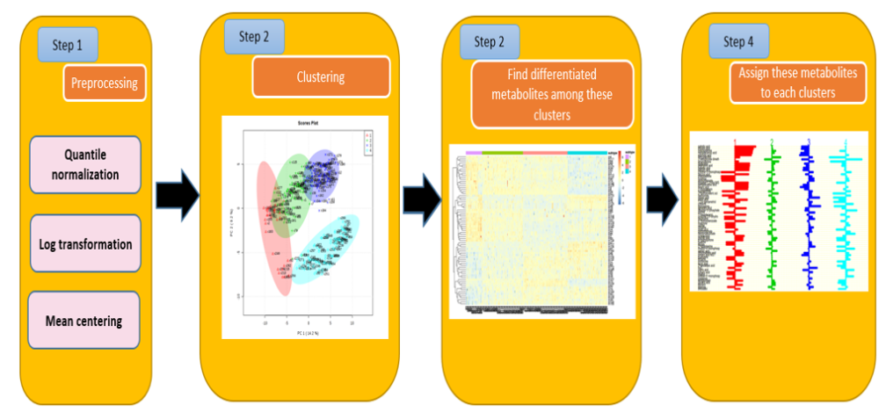

# Metabolomics_signature
In this notebook I will generate the figures in my paper entitled "Bioinformatics Analysis of Metabolomics Data Unveils Association of Metabolic Signatures with Methylation in Breast Cancer".
We want to cluster patients based on their metabolome profiles, then assign significant metabolites to these clusters. 
We will implement the below pipeline:

The whole process is in the below Jupyter notebook for dataset1 using k=4:
https://nbviewer.jupyter.org/github/FADHLyemen/Metabolomics_signature/blob/master/notebook/Notebook%20data1/four%20clusters/Metabolomics_signature-v1_kmeans_pam_data1_four_clusters.ipynb

dataset1 using k=3:
https://nbviewer.jupyter.org/github/FADHLyemen/Metabolomics_signature/blob/master/notebook/Notebook%20data1/three%20clusters/Metabolomics_signature-v1_kmeans_pam_data1_three_clusters.ipynb

dataset2 using k=3:
https://nbviewer.jupyter.org/github/FADHLyemen/Metabolomics_signature/blob/master/notebook/Notebook%20data2/Metabolomics_signature-v1_kmeans_pam_data2.ipynb
